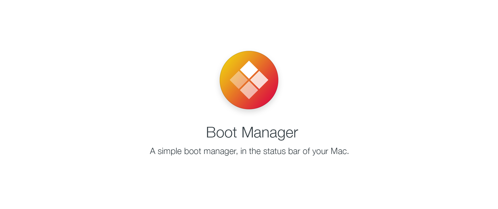

# Boot Manager

**Boot Manager** – Boot Manager is a handy utility to make it easier to reboot into your Boot Camp
windows drive, or even another macOS install. It will also not permanently change your startup disk
so once you reboot again, it’ll boot back to your standard OS. Choose to boot windows or another OS,
no more waiting around holding the option key. Great for bluetooth keyboard users where option key
might not always work.

Boot Manager is especially useful for people who use non-EFI graphics cards and therefore have
lost access to the startup manager when starting up their Mac.

## Features
### Quick Reboot
Quickly reboot into Windows or alternate macOS drives, no holding of option key or startup disk changing.

### Universal Compatibility
Enable menu bar only and have quick access to rebooting to your other operating systems.

### Reboot Helper
No more entering your password to reboot, authorize Boot Manager once and then be able to reboot quickly.

### Boot Camp on PCI-e SSD and SATA Controllers
Support for Boot Camp in EFI mode on PCI-e SSDs and SATA PCI-e controllers.

## Installing
1. Before installing Boot Manager if you want to use BootCamp on PCI-e SSDs or SATA PCI-e
controller cards you must disable the kext signature check. (Only for Mac Pro and Xserve)

To disable the kext signature check, you must restart on the recovery partition (Recovery HD) and access
the terminal in the Utilities menu and then execute the following commands:

```
csrutil disable
csrutil enable --without kext
```

**Note:** If you do not need to add Boot Camp support to PCI-e SSDs, SATA PCI-e controller
cards or you are not using Boot Manager on a Mac Pro / Xserve, you can skip this step.

2. Then go to the Releases section of the Boot Manager repository and download the latest installation
package, and install it normally by double-clicking on it.

## Copyright
- Copyright (c) 2017-2018 [Abdy Franco](http://abdyfran.co/)
- Copyright (c) 2013-2014 [Buttered Cat Software](http://buttered-cat.com)
